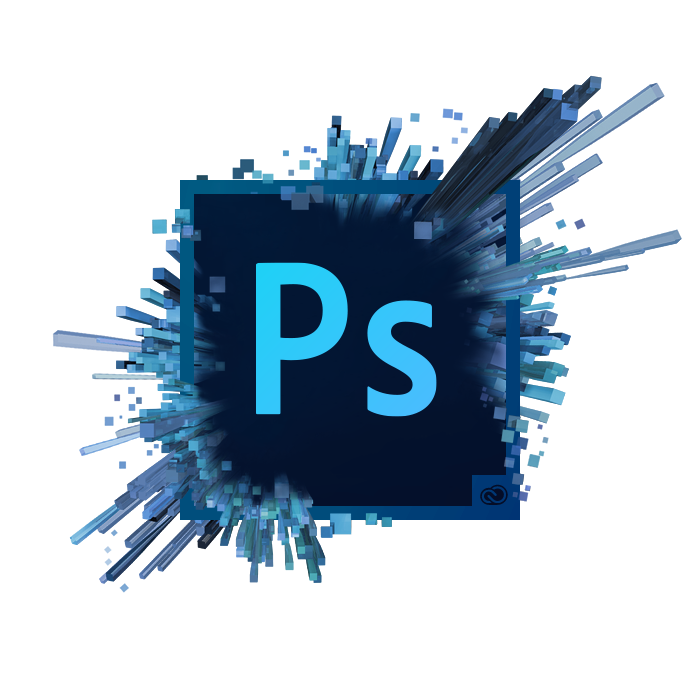

# 💻 Software Library

A professionally organized collection of software, installation resources, and essential digital tools to support academic excellence, scientific research, programming, engineering, mathematical computing, and professional development.

---

# 🍁 Maple 2015

  

A powerful mathematical computing environment designed for symbolic computation, numerical analysis, visualization, and engineering applications.

# 🍁 Maple 2026

  

The latest version of Maple for symbolic computation, numerical analysis, visualization, and engineering applications.

<mark>⚠️ **Important:** Keep your internet connection enabled while using the software. Otherwise, a license verification/host error may occur.</mark>

# 📊 MATLAB

  

A high-performance numerical computing platform widely used for data analysis, mathematical modeling, simulation, algorithm development, and engineering research.

# 🧮 Wolfram Mathematica

A powerful computational system for symbolic mathematics, numerical analysis, visualization, and scientific research.

  

# 🎨 Adobe Photoshop

A professional image editing and graphic design software widely used for photo editing, digital artwork, graphic design, and creative projects.

  

# 🎨 Adobe Illustrator

A professional vector graphics and illustration software widely used for creating logos, icons, illustrations, typography, diagrams, and high-quality graphic designs.

  

# 🏗️ AutoCAD

A professional computer-aided design (CAD) software widely used for creating precise 2D drawings, 3D models, architectural designs, engineering drawings, and technical documentation.

  

